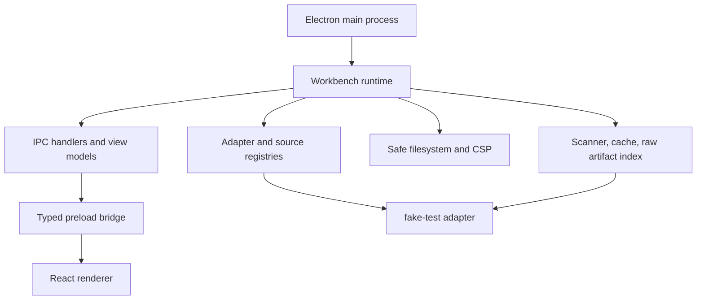

<!-- generated-by: gsd-doc-writer -->
# Architecture

## System overview

Agent Workbench is a local-first Electron desktop app that reads coding-agent session evidence from adapter-owned source roots, normalizes that evidence in the main process, and exposes read-only session and data-source view models to a React renderer. The current bundled runtime is intentionally small: it wires a shared ingestion and registry core to a single `fake-test` adapter so the app can prove harness-neutral boundaries before a real harness adapter lands.

## Component diagram



## Data flow

1. `src/main/electron-main.ts` waits for Electron readiness, creates the runtime, registers IPC handlers, and opens the main window.
2. `src/main/app/workbench-runtime.ts` assembles the adapter registry, source registry store, raw artifact index, normalized cache store, scanner, and watch orchestrator.
3. When a data source is validated or scanned through `src/main/ipc/handlers.ts`, the request is routed into `src/main/app/data-sources-view-model-service.ts`, which delegates validation and scan work to `src/main/core/ingestion/scanner.ts`.
4. The scanner asks the selected adapter to validate a root, discover sources, discover artifacts, parse raw events, and normalize them into shared entities defined by `src/main/core/adapter-contract/types.ts`.
5. Cached normalized records are merged by `src/main/app/session-view-model-service.ts` into renderer-facing summaries and previews.
6. `src/preload/index.ts` exposes a narrow `window.agentWorkbench` bridge, and the renderer consumes those methods from `src/renderer/App.tsx` and the route components under `src/renderer/routes/`.

## Key abstractions

| Abstraction | Role | Location |
|-------------|------|----------|
| `SessionSourceAdapter` | Contract every harness adapter implements for validation, discovery, parsing, normalization, and watch planning. | `src/main/core/adapter-contract/session-source-adapter.ts` |
| `AdapterNormalizationResult` | Shared normalized payload for projects, sessions, events, tool calls, shell commands, artifacts, and diagnostics. | `src/main/core/adapter-contract/types.ts` |
| `WorkbenchRuntime` | Composition root object that bundles the registries, cache, scanner, and watch orchestrator used by the app. | `src/main/app/workbench-runtime.ts` |
| `Scanner` | Shared ingestion coordinator that validates sources, detects changes, parses adapter artifacts, and refreshes cached normalized output. | `src/main/core/ingestion/scanner.ts` |
| `SourceRegistry` | File-backed registry for configured source roots and their validation, scan, cache, and watch summaries. | `src/main/core/registry/source-registry.ts` |
| `SafeFilesystem` | Adapter-scoped filesystem facade that limits reads to configured roots and indexed artifacts. | `src/main/core/security/safe-filesystem.ts` |
| `registerIpcHandlers` | Main-process IPC boundary that validates payloads with Zod and exposes only sanctioned read-only operations. | `src/main/ipc/handlers.ts` |
| `fakeTestAdapter` | Bundled proof adapter used to exercise the shared contract without depending on a real harness yet. | `src/main/adapters/fake-test/index.ts` |

## Directory structure rationale

```text
src/
  main/
    adapters/   Harness-specific discovery, parsing, and normalization
    app/        Runtime assembly and view-model services
    core/       Shared contracts, registries, ingestion, cache, security, watcher logic
    ipc/        Channel names, request/response schemas, and handler registration
    security/   BrowserWindow-facing security helpers
  preload/      Typed bridge exposed to the renderer
  renderer/     React app, routes, and presentational components
tests/
  adapters/     Adapter-specific fixtures and golden tests
  boundaries/   Import and naming guardrails
  contract/     Shared adapter contract suite
  main/         Main-process unit coverage
  preload/      Preload API coverage
  renderer/     Renderer route coverage
  security/     Electron and renderer security guardrails
```

The layout mirrors the ownership rules enforced by the project: shared code lives in `src/main/core/`, adapter-private code stays under `src/main/adapters/`, the preload layer is the only renderer bridge, and the renderer consumes view models rather than adapter internals. The test tree repeats those same boundaries so architecture regressions fail fast.
