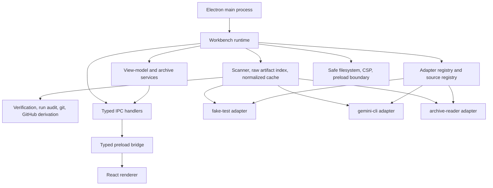

<!-- generated-by: gsd-doc-writer -->
# Architecture

## System overview

Agent Workbench is a local-first Electron desktop app that reads coding-agent session evidence from adapter-owned source roots, normalizes it in the main process, derives shared verification and run-audit truth, and exposes read-only view models to a React renderer. The bundled adapter set now includes `fake-test`, `gemini-cli`, and `archive-reader`, so the shared runtime has to support both live local harness roots and imported read-only archives without adapter-specific renderer branches.

## Component diagram



## Data flow

1. `src/main/electron-main.ts` waits for Electron readiness, creates a shared runtime rooted in `app.getPath("userData")`, registers IPC handlers and typed services, and opens the main window.
2. `src/main/app/workbench-runtime.ts` assembles the bundled adapter registry, source registry, raw artifact index, normalized cache store, scanner, and watch orchestrator.
3. `src/main/app/data-sources-view-model-service.ts` owns add, update, enable, validate, and scan actions for mutable sources. Imported archives stay read-only and cannot be added through the normal source form.
4. `src/main/core/ingestion/scanner.ts` validates a source, asks the selected adapter to discover artifacts, parses raw evidence, normalizes shared entities, derives shell summaries plus verification, run-audit, git, and GitHub state, and persists the result into the file-backed cache.
5. `src/main/app/triage-view-model-service.ts`, `session-view-model-service.ts`, `session-detail-view-model-service.ts`, `run-audit-view-model-service.ts`, and `diagnostics-view-model-service.ts` merge cached normalized data into main-owned DTOs for Overview, Projects, Sessions, Session Detail, Run Audit, Diagnostics, and Data Sources.
6. `src/main/app/archive-export-service.ts` and `archive-import-service.ts` wrap the shared archive exporter and importer so projects or sessions can be exported as manifest-backed archives and later re-imported as persistent `archive-reader` sources.
7. `src/main/theme/**` owns persisted theme preference and effective-theme resolution, `src/preload/index.ts` exposes separate narrow `window.agentWorkbench` and `window.agentWorkbenchTheme` bridges, and the renderer consumes those bridges through `src/renderer/bridge/**`, `src/renderer/providers/theme-provider.tsx`, and `src/renderer/routes/route-registry.tsx` without direct main-process imports.

## Key abstractions

| Abstraction | Role | Location |
|-------------|------|----------|
| `SessionSourceAdapter` | Contract every harness adapter implements for validation, discovery, parsing, normalization, optional artifact loading, and watch planning. | `src/main/core/adapter-contract/session-source-adapter.ts` |
| `WorkbenchRuntime` | Composition root object that bundles registries, caches, scanner, and watch orchestration used by the desktop shell. | `src/main/app/workbench-runtime.ts` |
| `Scanner` | Shared ingestion coordinator that validates sources, refreshes cached normalized output, and derives verification, run-audit, git, and GitHub truth. | `src/main/core/ingestion/scanner.ts` |
| `SourceRegistry` | File-backed registry for configured source roots, imported archives, and each source's validation, scan, cache, and watch summaries. | `src/main/core/registry/source-registry.ts` |
| `ArchiveExporter` / `ArchiveImporter` | Shared read-only archive layer that exports manifest-backed snapshots and rehydrates them as `archive-reader` sources. | `src/main/core/archive/` |
| `SafeFilesystem` | Adapter-scoped filesystem facade that limits reads to configured roots and indexed raw artifacts. | `src/main/core/security/safe-filesystem.ts` |
| `registerIpcHandlers` | Main-process IPC boundary that validates payloads with Zod and exposes only sanctioned bridge methods. | `src/main/ipc/handlers.ts` |
| `createBundledAdapterRegistry` | Bundles the built-in `archive-reader`, `fake-test`, and `gemini-cli` adapters into the shared runtime. | `src/main/core/registry/register-bundled-adapters.ts` |

## Directory structure rationale

```text
src/
  main/
    adapters/   Harness-specific discovery, parsing, and normalization
    app/        Runtime assembly plus view-model and archive services
    core/       Shared contracts, registries, ingestion, cache, audit, archive, git, GitHub, and security
    ipc/        Channel names, request/response schemas, and handler registration
    security/   BrowserWindow-facing security helpers
  preload/      Typed bridge exposed to the renderer
  renderer/
    bridge/     Typed wrappers around preload bridge methods
    components/
      app/      Shared workbench composites and cross-feature presentation
      ui/       Shadcn-backed renderer primitives
    features/   Domain-owned routes and components
    lib/        Renderer-only utilities
    providers/  Renderer runtime providers such as theme state
    routes/     Central route registry only
    styles.css  Foundation-only tokens, base styles, and theme defaults
tests/
  adapters/     Adapter-specific fixtures and golden tests
  boundaries/   Import and naming guardrails
  contract/     Shared adapter contract suite
  main/         Main-process and service coverage
  preload/      Preload API coverage
  renderer/     Route and truth-state coverage
  security/     Electron and renderer security guardrails
```

The layout mirrors the enforced ownership rules: shared code lives in `src/main/core/`, adapter-private code stays under `src/main/adapters/`, preload is the only renderer bridge, and renderer routes consume IPC view models rather than adapter internals. The renderer is now feature-scoped rather than flat: reusable UI lives under `components/ui` and `components/app`, domain routes and components stay inside `features/*`, `src/renderer/routes/` is limited to the registry, and `src/renderer/styles.css` is foundation-only instead of owning product layouts. The test tree repeats those same seams so boundary, truth-state, and security regressions fail fast.
